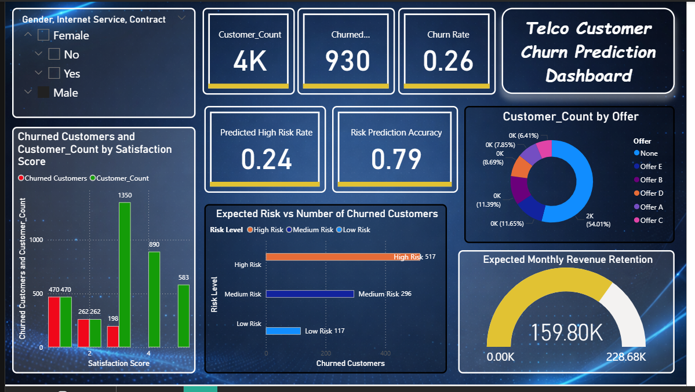

📊 Customer Churn Prediction Dashboard

🚀 Project Overview

Customer churn is one of the most critical challenges in the telecommunications industry. Retaining existing customers is significantly more cost-effective than acquiring new ones.

This project presents a data-driven Power BI dashboard designed to:

Identify churn patterns
Analyze key drivers of customer attrition
Enable proactive retention strategies
🎯 Problem Statement

Telecom companies struggle to:

Detect customers likely to churn
Understand reasons behind churn
Take timely action to retain users

This dashboard provides a centralized and interactive solution to address these challenges.

💡 Solution

An interactive Power BI dashboard built using the IBM Telco Customer Churn dataset, offering actionable insights through visual analytics.

📌 Key Features
📈 KPI Cards
Total Customers: 7K
Churned Customers: 2K
Avg CLTV: ₹4.4K
Churn Rate: 26.5%
🧩 Top 10 Churn Reasons (Treemap)
Competitor pricing
Product dissatisfaction
Poor support experience
Network issues
🥧 Churn Rate by Offer (Pie Chart)
No-offer customers contribute ~56% of churn
📊 Churn Value by Contract (Bar Chart)
Month-to-Month: Highest churn
Long-term contracts: Lower churn
😊 Satisfaction vs Churn (Clustered Bar Chart)
Low satisfaction = high churn risk
💰 Revenue Retention Gauge
₹316.99K retained out of ₹456.12K
🎛️ Interactive Filters
Gender
Internet Service
Contract Type
🖥️ Dashboard Preview

📌 (Refer to Page 2 of the documentation for the full dashboard screenshot)

⚙️ Tech Stack
Component	Technology Used
Visualization Tool	Microsoft Power BI Desktop
Dataset	IBM Telco Customer Churn
Data Format	CSV / Excel (.xlsx)
Data Transformation	Power Query (M Language)
Calculations	DAX
Platform	Power BI Desktop (Windows)
🌟 Highlights
Combines financial + behavioral + promotional insights
Includes revenue impact analysis (rare in churn dashboards)
Uses interactive slicers for dynamic exploration
Clean, dark-themed UI for better readability
Covers complete churn lifecycle analysis
🔮 Future Improvements
🤖 Integrate ML models (Logistic Regression, Random Forest)
📊 Add RFM-based customer segmentation
☁️ Connect to live cloud/SQL database
📉 Add time-series churn trends
🎛️ Introduce What-if analysis panel
🔍 Build drill-through customer-level insights
📂 Project Files
📄 Full Documentation: (Attached PDF)
📊 Power BI Dashboard File (.pbix) (if uploaded separately)
🏁 Conclusion

This project demonstrates how data visualization + business intelligence can transform raw data into actionable insights, helping organizations reduce churn and improve customer retention.

##Live Demo

Customer Churn Prediction Dashboard

